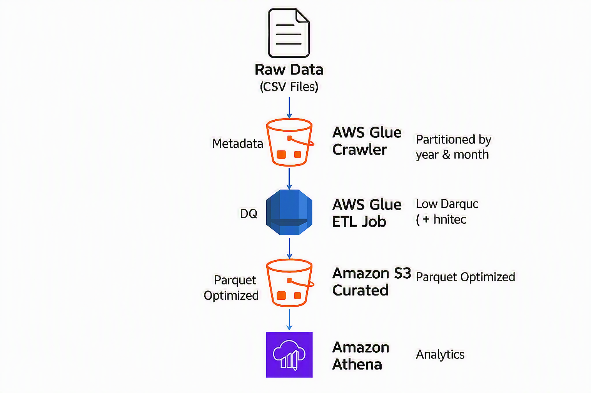

# 🚀 AWS Serverless Data Lake (Production-Grade Pipeline)

Designed and implemented a scalable serverless data engineering pipeline on AWS to process and analyze transactional data.

✅ End-to-end ETL pipeline using AWS Glue (PySpark)
✅ Partitioned data lake architecture (year, month)
✅ Optimized Athena performance using Parquet format
✅ Real-time analytics capability using serverless services
---

## 🧱 Architecture


---

## ⚙️ Tech Stack
- AWS S3
- AWS Glue (ETL)
- AWS Athena
- Python (PySpark)

---

## 🔄 Pipeline Flow

1. Raw CSV data uploaded to S3
2. AWS Glue crawler creates metadata
3. Glue ETL job:
   - Cleans data
   - Removes duplicates
   - Converts to Parquet
   - Partitions data (year, month)
4. Data stored in curated layer
5. Athena queries for analytics

---

## 📊 Sample Queries

```sql
SELECT year, month, SUM(amount)
FROM curated_sales
GROUP BY year, month;
``
